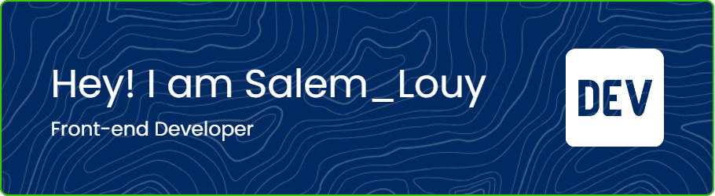

<h1 align="center">Hi 👋, I'm Salem Louafi</h1>
<h3 align="center">A passionate frontend developer from Algeria</h3>

  

  

- 🌱 I’m currently learning **Front-end Framwork**

- 💬 Ask me about **react ,next**

- 📫 How to reach me **louafisalem79@gmail.com**

<h3 align="left">Connect with me:</h3>

<h3 align="left">Languages and Tools:</h3>

                 

&nbsp;

